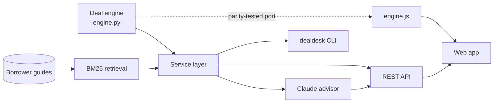

# Borrower's Deal Desk

[](https://github.com/ketibak-ai/business-loan-deal-desk/actions/workflows/ci.yml)
[](https://ketibak-ai.github.io/business-loan-deal-desk/)

**A business loan calculator that shows you the bank's side of the deal.**

A mortgage calculator tells you the payment. This tells a business owner five things:

1. **What the loan really costs:** payment, APR with fees included, balloon, and cost per $1 borrowed. Floating rates follow a **SOFR forward curve**, and a rate shock shows what a 1% move would cost.
2. **Whether the business can carry it:** debt service coverage, leverage, collateral coverage, and the most you could borrow.
3. **Which loan types fit:** term, line of credit, equipment, CRE, SBA 7(a), SBA 504, invoice financing, or merchant cash advance.
4. **How the bank is probably pricing it:** using the model a bank would apply to *your* segment. **Small business** gets a credit scorecard, pooled PD, retail capital and a rate grid with limited banker discretion. **Commercial** gets a risk rating, economic capital and relationship RAROC. It shows the rate that earns the bank's return target on the loan alone and its **walk-away rate** once your deposits and services are counted.
5. **What to negotiate:** each option (deposits, treasury services, collateral, guarantee, term, fees, prepayment, covenants, competing offer) re-run through the bank's model and valued in dollars. It also writes your talking points.

It is the mirror image of [commercial-lending-raroc](https://github.com/ketibak-ai/commercial-lending-raroc). That project prices a commercial loan book from the bank's side. This one takes the same RAROC method (12% hurdle, Basel IRB capital, funds transfer pricing, relationship pricing) and hands it to the borrower.

**Live app:** https://ketibak-ai.github.io/business-loan-deal-desk/

> For education and planning only. Not a loan offer, credit decision or financial advice. Bank-side figures are estimates from a standard pricing model; every lender's model differs. Market rates and the SOFR curve in the example are illustrative, so enter today's rates.

---

## Example: Cedar & Pine Millwork

The business is a manufacturer with 12 years in business, $6.2M revenue, $850K EBITDA and $900K of existing debt. It has been offered a **$1.2M term loan at SOFR + 325 bps** with a 5-year term, 7-year amortization and a 1% fee.

| | Rate | Spread |
|---|---:|---:|
| Offered | 6.90% | 325 bps |
| Bank's loan-only target (12% RAROC) | 5.77% | 212 bps |
| **Bank's estimated walk-away** (with the relationship) | **5.30%** | **165 bps** |
| Cost floor (funding + expected loss + servicing) | 4.58% | 93 bps |
| Suggested opening ask | 5.70% | 205 bps |
| Realistic outcome | 6.10% | 245 bps |

- **True cost:** 7.40% APR and a $18,053 first payment. The rate follows the SOFR curve, averaging 6.86% over the term (6.82% in year 1, 7.04% in year 5), with a $403,516 balloon in year 5.
- **Rate risk:** if SOFR runs 1% above the curve, the loan costs about $44K more over the term.
- **Affordability:** 1.86x debt service coverage and 2.47x debt to EBITDA. Collateral covers only $910K, so expect the bank to lean on the personal guarantee.
- **Bank's return:** the bank's estimated RAROC at the offered rate is **24%**, double its 12% hurdle. That leaves about **160 bps of room**, worth about **$33K** at the realistic outcome.
- **Best options:** moving $400K of operating deposits (about 73 bps, $30K), adding treasury services (34 bps), and the competing 6.60% offer (30 bps).
- **Compare offers:** the competing bank's lower 6.60% rate has *higher* fees, so its APR is worse than the 6.90% offer. The lowest rate is not the cheapest loan.

**The same business as a small-business loan:** if it were priced in the small-business segment instead, the scorecard gives 83 (band B, 1.2% PD). The model still shows 151 bps of economic room, but a banker working from a rate grid can usually move only about 50 bps. That's the difference between negotiating in business banking and in commercial banking.

Run it yourself: `dealdesk analyze`

---

## Architecture



The API, CLI and agent all call one service layer, so they always report the same numbers. The browser runs `engine.js`, a line-for-line port of the Python engine. A test runs both on 27 scenarios covering every product, both bank segments, rate curves and edge cases, and fails if any result differs.

## The engine

| Engine | What it computes |
|---|---|
| Cost | Amortization with balloon, line of credit (drawn interest + unused fee), MCA (daily remittance). Floating loans reset monthly along a SOFR forward curve (spot SOFR at month 0, then editable points out to 10 years, linear between them); Prime moves with SOFR, and the payment re-amortizes each month. A parallel rate shock stress-tests the path. APR is solved as the IRR of net proceeds against every payment and fee. |
| Capacity | DSCR, debt/EBITDA and collateral coverage, plus the maximum loan at 1.25x DSCR, 3.5x leverage and the collateral advance rate, and which one binds. Also covenant headroom. |
| Bank view | **Segment:** small business (revenue ≤ $5M and total debt ≤ $1.5M, or chosen manually) or commercial. **Small business:** a 0–100 scorecard weighted to owner credit maps to bands A–E with pooled PDs, capital is Basel IRB *retail* (or a 100% risk weight × 10%, editable to Basel's 75%), fixed servicing cost is lower (automated underwriting), and negotiable room is capped at banker discretion (50 bps). **Commercial:** risk rating from DSCR, leverage, years, credit score and industry, mapped to a probability of default (PD). LGD from collateral and guarantee. Capital is the higher of Basel IRB corporate (99.9%, with maturity and the SME firm-size adjustment) and a 10% regulatory minimum. The SBA guaranteed share carries 1.6% capital. Required income = hurdle × capital ÷ (1 − tax) − capital credit + servicing + expected loss. Deposits (after run-off) and treasury fees lower the relationship floor. Floating loans (SOFR or Prime) are funded at SOFR. Fixed loans are funded at the matched-maturity swap rate implied by the curve, not the Treasury index they are quoted over. |
| Levers | Each option is applied to a copy of the scenario and re-run. Its value is the drop in the bank's walk-away rate (or the fee saved), in bps and dollars over the term. |

All assumptions are editable in the app and the API (`assume` and `mkt` blocks).

## API

`uvicorn dealdesk.api:app` serves the web app at `/` and interactive docs at `/docs`.

| Method | Path | Purpose |
|---|---|---|
| GET | `/health`, `/metrics` | Liveness; Prometheus-style metrics |
| GET | `/api/catalog` | Loan types with typical terms; industry and collateral codes |
| GET | `/api/example` | The example scenario (same JSON the web app saves) |
| POST | `/api/analyze` | Full analysis: cost, capacity, fit, bank view, levers, talking points |
| POST | `/api/negotiate` | Negotiation plan only |
| POST | `/api/compare` | Rank fixed-rate quotes by APR and total cost |
| POST | `/api/guides/search` | Search the borrower guides (cited sections) |
| POST | `/api/ask` | Ask the Claude borrower's advisor |

Scenarios can be partial. Missing fields take defaults, so `{"loan": {"product": "sba7a", "amount": 400000}}` is a valid request. Set `APP_API_KEY` to require an `X-API-Key` header on `/api/*`.

## Claude borrower's advisor

`src/dealdesk/agent.py` is a Claude tool-use agent (default `claude-opus-5`, adaptive thinking, prompt caching, server-side refusal fallback). It has five tools: `analyze_loan`, `negotiate_loan`, `compare_offers`, `list_loan_products` and `search_guides`. Every figure comes from a tool, and guide answers cite `[Guide: document § section]`. Tool inputs are validated, and errors go back to the model. Borrower financials are not written to the logs.

```bash
export ANTHROPIC_API_KEY=...
dealdesk ask "I was offered a $500K SBA 7(a) at Prime + 2.75. EBITDA is $180K. Is that a good deal?"
```

## Quick start

```bash
pip install -e ".[dev]"
dealdesk analyze                       # the example; --file my_scenario.json for yours, --json for raw output
dealdesk compare --file examples/cedar_and_pine.json
uvicorn dealdesk.api:app --reload      # http://localhost:8000
```

Docker:

```bash
docker build -t business-loan-deal-desk .
docker run -p 8000:8000 -e ANTHROPIC_API_KEY=... business-loan-deal-desk
```

## Quality

| Check | Where | Result |
|---|---|---|
| Unit tests: annuity formula, APR = rate with no fees, balloon, MCA APR, SOFR curve interpolation, rate shock, Prime tracking SOFR, swap-rate funding, Basel reference point (PD 1%, LGD 45% gives K ≈ 7.4%), floor ordering, hurdle solved exactly, lever direction | `tests/test_engine.py` | pass |
| API contract, validation, auth, strict JSON; agent loop against a scripted fake Claude client | `tests/test_api_and_agent.py` | pass |
| Browser engine equals Python engine on 27 scenarios, including both bank segments and flat, shocked and fixed-rate curves | `tests/test_js_parity.py` | pass |
| Guide retrieval: 24 questions | `evals/retrieval_eval.py` | 100% hit@3, 92% hit@1 |
| Live agent eval: 9 questions, graded on tools called, engine numbers and phrases | `evals/agent_eval.py` | manual workflow (needs an API key) |

CI runs lint, tests and the retrieval eval, builds the Docker image, and smoke-tests the running container. A second workflow deploys the web app to GitHub Pages.

## Layout

```
src/dealdesk/   engine.py, config.py, models.py, service.py, agent.py, rag.py, api.py, cli.py, site.py, observability.py
src/dealdesk/web/   index.html, app.js, engine.js (browser app)
knowledge/      borrower guides the advisor cites
tests/  evals/  examples/  .github/workflows/
```

## License

MIT
